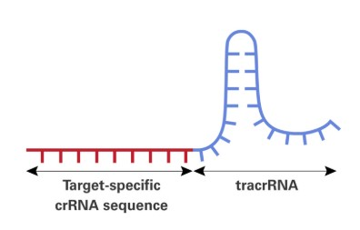

## CRISPR Base-Editor Guide Planner
 CRISPR-Cas9 systems, originally discovered as part of the adaptive immune system of bacteria, have revolutionized genome editing by enabling precise and efficient DNA modifications using RNA-guided endonucleases. 

In particular, CRISPR base-editor is an advanced tool that generates single-nucleotide changes without introducing double-strand breaks. This holds great promise for studying genetic variants and therapeutic applications. Designing guide RNAs (gRNAs) for base editing is challenging and requires detailed computation to ensure specificity and efficacy. 

## Aim

<p>This project aims to develop a Python-based tool to assist us - students and researchers - in designing and evaluating gRNAs tailored for CRISPR base-editing. The tool will retrieve genomic data, identify candidate gRNAs and simulate their potential edits at the codon level. It will then assess the effect of the induced mutation on the amino acid sequence. 
  
From the provided list of valid guides relevant once can be chosen based on the specific needs for the study. For example, guides that promote mutations associated with disease.</p>

<p>As part of my research on the devastating neurodegenerative disease Amyotrophic lateral sclerosis (ALS) I aim to model familial SOD1-ALS in cell culture. This program will help me design guides for creating ALS-related mutations in HT29 cells that have the CRISPR base-editor integrated into their genomes.</p>

*For chosen guides it is recommended to check off target effects using BLAST or similar programs.  

## Overview of the Workflow
**Data Retrieval:**
- User provides a gene name (e.g., "SOD1").
- The program queries NCBI to:  
  Retrieve the Gene ID.  
  Retrieve the Nucleotide (RefSeq) ID.  
  Fetch the full nucleotide coding sequence.
  
**Guide Identification:**
- Finds NGG PAM sites in the nucleotife sequence.
- Extracts 20-base guides upstream of each NGG.
- Filters guides based on:  
  GC content (8-12).  
  No "TTTT" in the sequence (can act as transcription terminator leading to low sgRNA expression levels).   
  Ensuring at least one G in the editing window (positions 4-8 from PAM, 3'-to-5').

**Mutation Simulation:**  
(C → T edits in the antisense DNA strand result in G → A edits in the sense DNA strand).
  
- Converts G → A in the editing window (one at a time).
- Reconstructs the mutated sequence.
- Classifies mutations into:  
  Silent Mutation → No change in the amino acid sequence.  
  Missense Mutation → Changes the amino acid.  
  Nonsense Mutation → Introduces a stop codon (*). 

**Store and Save Results:**
- Stores guide sequence, guide's position in the sequence, number of Gs in the editing window, the mutation type, the original and "mutated" amino acid and the position of   the edited G in the sequence.
  (Only stores guides that cause non-silent mutation)
- Exports data to a CSV file (gRNA_results.csv).

## Requirments
- Python 3.8+
- Python packages : Requests, BioPython
```bash
pip install requests biopython
````
## Running the program
- To execute the full pipeline, run:
```bash
python main.py
```
- The program will ask you to "Enter the gene of interest:"

## Testing the code 
There are test codes for the different modules to verify that the program functions correctly and produces the expected results. 
## Remarks 
This project is a final assignment for the [Basic programming in Pyhton course](https://github.com/szabgab/wis-python-course-2024-11) at the Weizmann Institute of Science taught by [Gabor Szabo](https://github.com/szabgab). 

